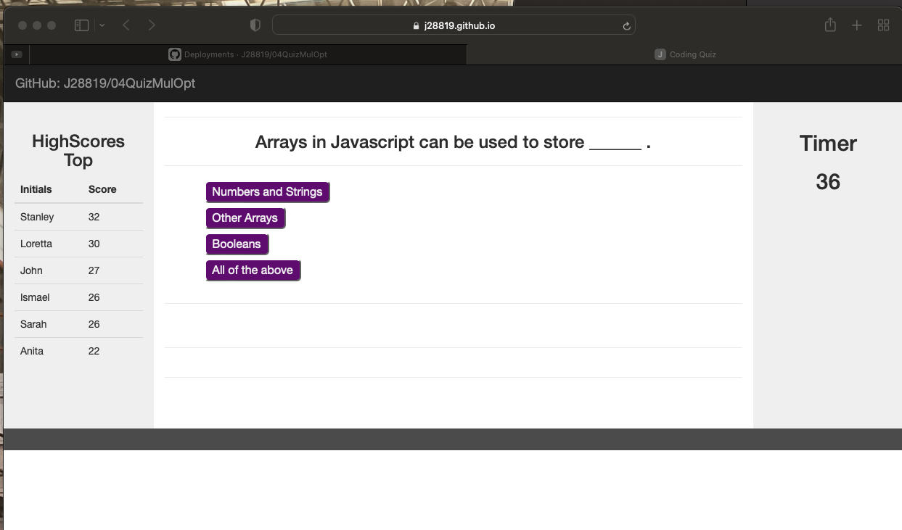

# 04QuizMulOpt
Quiz with Multiple options and Score Results


## Locations 

Index.html -> Contain all the code that will be processes by the browser to display in the end user display assets -> contain all the formating code (CSS) and pictures that will be displayed in the front end.

## Installation

1. To clone the repository in your computer run this command.

```bash
git clone git@github.com:J28819/04QuizMulOpt.git

```

2. Then open it with Visual Code and run Live Server on the [Index.html file.]

3. You can Follow this link : 


## Description

This Quiz has multiple options, and use a JSON Object to customize the questions its also use local storage to record and shows the last Highest Scores.

## Screenshoots



## Conclusion 

It was a great experience works in this project.


## License
[MIT](https://choosealicense.com/licenses/mit/)
